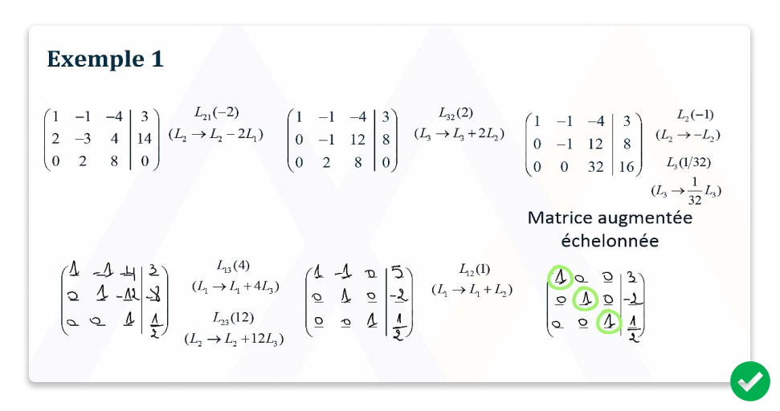
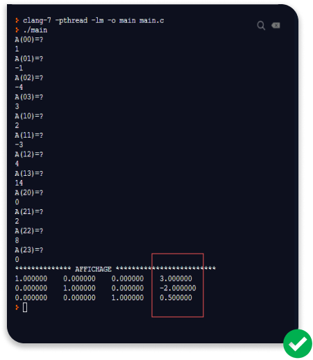

# Gaussian elimination or row reduction Algorithm 

<h2> What for?</h2>

for solving a system of linear equations.
*This code is the application of that math method* 
Do you know how to solve a system of linear equation?

***Let see how we solve it*** 

here is one example:

- <strong>x  -  y - 4z  =  3</strong> 
- <strong>2x - 3y + 4z  = 14</strong> 
- <strong>0  + 8y + 2z  =  0</strong>

  

Easy hen!👌😅😂

<h2>explanning the algorithm<h2/>  

***General Introduction*** 

  

# Note Analysis:
